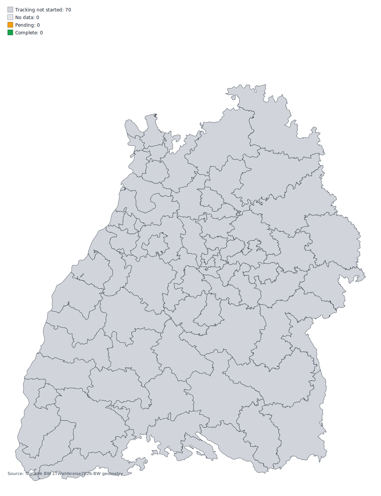

# Landtagswahl Baden-Wuerttemberg 2026 - Tracking Template

## Tracking Window

Automated tracking is scheduled to commence at **2026-03-08 18:00 CET**.
No official results are expected before **2026-03-08 18:00 CET**, so polling is intentionally disabled until then.

## Data Sources (Planned)

- `komm.one` municipality APIs (template: `https://wahlergebnisse.komm.one/lb/produktion/wahltermin-{wahltermin}/{ags}` + `/daten/api/...`)
- Statistik BW single CSV: `https://www.statistik-bw.de/fileadmin/user_upload/Wahlen/Landesdaten/ltw26_daten.csv` (fallback: `https://www.statistik-bw.de/fileadmin/user_upload/Presse/Pressemitteilungen/2026021_LTW26-Dummy-Datei.csv`)
- Wahlkreis geometry (GeoJSON ZIP): `https://www.statistik-bw.de/fileadmin/user_upload/medien/bilder/Karten_und_Geometrien_der_Wahlkreise/LTWahlkreise2026-BW_GEOJSON.zip`
- Wahlkreis geometry (SHP ZIP): `https://www.statistik-bw.de/fileadmin/user_upload/medien/bilder/Karten_und_Geometrien_der_Wahlkreise/LTWahlkreise2026-BW_SHP.zip`

## Wahlkreis Map

Map file and status table are prepared from official published geometry in `data/ltw26/metadata/`.

## Map QA (Schaubild 8)

- Last run (UTC): **2026-03-01T10:39:51.744412+00:00**
- IoU vs Schaubild 8 page 63: **0.926** (threshold **0.900**)
- Passed: **True**
- Validation command: `python scripts/test_map_against_schaubild8.py`

## Party Totals (First and Second Votes)

| Vote Type | Party | Count | Share |
|---|---|---:|---:|
| Erststimmen | - | 0 | 0.00% |
| Zweitstimmen | - | 0 | 0.00% |

## Operations

- Local run after start: `python scripts/poll_ltw26.py`
- SQLite history DB (local cache, not committed): `data/ltw26/history.sqlite`
- Rebuild SQLite from git deltas: `python scripts/rebuild_history_sqlite_from_git_deltas.py`
- Minute automation: `.github/workflows/poll.yml`
